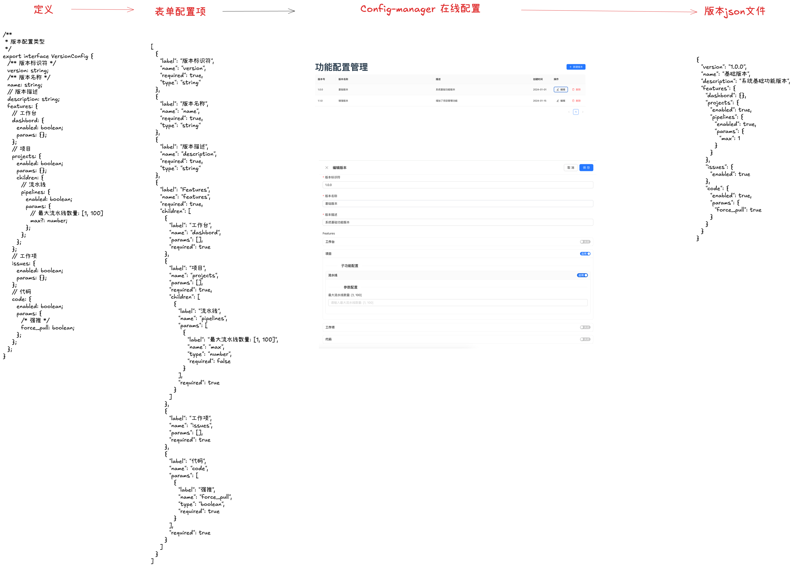

# 版本-功能清单

本演示展示了如何基于功能清单实现一套代码支持多个版本部署的完整方案。

## 项目演示截图



## 项目架构

采用 Monorepo 架构，包含一个通用前端项目和一个配置管理项目，通过动态配置实现多版本功能。

### 版本主线策略

项目采用三个主要版本线：

- **社区版 (Community)**: 免费版本，提供基础功能
- **专业版 (Professional)**: 面向不同客户的定制版本，支持多个子版本
- **企业版 (Enterprise)**: 完整功能的企业级版本

专业版支持针对不同客户的定制化配置，通过版本标识符区分（如 `pro-client1`、`pro-client2` 等）。

### 技术栈

- **前端**: React + TypeScript + Vite
- **包管理**: pnpm (支持 workspace)
- **构建工具**: Vite + Rollup
- **版本管理**: 基于动态配置的版本控制
- **配置管理**: 在线配置生成器
- **类型定义**: TypeScript + 配置驱动的类型生成

## 项目结构

```
FeatureList/
├── packages/
│   ├── app/                 # 通用前端应用
│   │   ├── src/
│   │   │   ├── App.tsx
│   │   │   ├── main.tsx
│   │   │   ├── hooks/       # 自定义钩子
│   │   │   └── components/  # 应用组件
│   │   ├── package.json
│   │   ├── vite.config.ts
│   │   └── index.html
│   ├── config-manager/      # 配置管理前端
│   │   ├── src/
│   │   │   ├── App.tsx
│   │   │   ├── main.tsx
│   │   │   ├── components/  # 配置界面组件
│   │   │   └── services/    # 配置服务
│   │   ├── package.json
│   │   ├── vite.config.ts
│   │   └── index.html
│   └── define/              # 类型定义和配置包
│       ├── src/
│       │   ├── config.json  # 配置字段定义
│       │   ├── index.ts     # 导出定义
│       │   └── types.ts     # TypeScript 类型定义
│       ├── cli/
│       │   └── index.js     # 构建脚本
│       ├── package.json
│       └── rollup.config.js
├── demo.sh                  # 演示启动脚本
├── sync-configs.sh          # 配置同步脚本
├── validate.sh              # 项目验证脚本
├── package.json             # 根目录配置
├── pnpm-workspace.yaml      # pnpm 工作空间配置
├── tsconfig.json            # 根 TypeScript 配置
├── screenshot.png           # 项目演示截图
└── README.md
```

## 功能清单配置

### 动态配置架构

系统采用动态配置方式，通过类型安全的配置定义和 JSON 配置文件实现不同版本的功能特性。配置定义基于 `packages/define` 包中的类型系统：

```typescript
// 基于 packages/define/src/types.ts 的配置文件结构
export interface VersionConfig {
  /** 版本标识符 */
  version: string;
  /** 版本名称 */
  name: string;
  /** 版本描述 */
  description: string;
  features: {
    // 工作台
    dashbord: {
      enabled: boolean;
      params: {};
    };
    // 项目
    projects: {
      enabled: boolean;
      params: {};
      children: {
        // 流水线
        pipelines: {
          enabled: boolean;
          params: {
            // 最大流水线数量: [1, 100]
            max?: number;
          };
        };
      };
    };
    // 更多功能...
  };
}
```

### 配置生成工具

项目包含完整的配置管理工具链：

- **`packages/define`**: 类型定义和配置字段定义包
- **配置管理器**: 在线可视化配置编辑器
- **类型安全**: TypeScript 类型检查确保配置正确性

### 版本配置示例

配置文件通过配置管理器生成，并同步到各个应用的 public 目录中：

**社区版** (Community - 基础功能):

```json
{
  "version": "community",
  "name": "社区版",
  "description": "免费的社区版本，提供基础功能",
  "features": {
    "dashbord": {
      "enabled": true,
      "params": {}
    },
    "projects": {
      "enabled": true,
      "params": {},
      "children": {
        "pipelines": {
          "enabled": false,
          "params": { "max": 1 }
        }
      }
    }
  }
}
```

**专业版** (Professional - 客户定制):

```json
{
  "version": "pro-client1",
  "name": "专业版 - 客户A",
  "description": "针对客户A定制的专业版本",
  "features": {
    "dashbord": {
      "enabled": true,
      "params": {}
    },
    "projects": {
      "enabled": true,
      "params": {},
      "children": {
        "pipelines": {
          "enabled": true,
          "params": { "max": 10 }
        }
      }
    }
  }
}
```

**企业版** (Enterprise - 完整功能):

```json
{
  "version": "enterprise",
  "name": "企业版",
  "description": "完整功能的企业级版本",
  "features": {
    "dashbord": {
      "enabled": true,
      "params": {}
    },
    "projects": {
      "enabled": true,
      "params": {},
      "children": {
        "pipelines": {
          "enabled": true,
          "params": { "max": 100 }
        }
      }
    }
  }
}
```

## 开发流程

### 1. 环境准备

```bash
# 安装 pnpm
npm install -g pnpm

# 安装依赖
pnpm install
```

### 2. 开发命令

```bash
# 启动通用前端应用 (默认基础版本)
pnpm dev:app

# 启动配置管理器
pnpm dev:config

# 启动指定版本
pnpm dev:community    # 社区版
pnpm dev:pro          # 专业版（默认）
pnpm dev:pro:client1  # 专业版 - 客户A
pnpm dev:pro:client2  # 专业版 - 客户B
pnpm dev:enterprise   # 企业版

# 构建应用
pnpm build:all      # 构建所有项目
pnpm build:app      # 构建通用应用
pnpm build:config   # 构建配置管理器
```

### 3. 版本切换方式

#### 方式一：URL 参数

```
http://localhost:3000?version=community
http://localhost:3000?version=pro-client1
http://localhost:3000?version=pro-client2
http://localhost:3000?version=enterprise
```

#### 方式二：环境变量

```bash
VITE_VERSION=pro-client1 pnpm dev:app
```

#### 方式三：界面切换

在应用右上角使用版本选择器进行实时切换

### 4. 配置管理

1. 访问配置管理器: http://localhost:3001
2. 选择要编辑的版本
3. 调整功能开关和主题设置
4. 预览效果或导出配置文件
5. 将配置文件通过 `pnpm sync:configs` 同步到应用

## 部署策略

### 1. 单应用多版本部署

通用应用支持通过配置实现多版本部署：

```bash
# 构建通用应用
pnpm build:app

# 部署到不同环境
# 社区版
VITE_VERSION=community pnpm build:app
# 部署到 community.example.com

# 专业版 - 客户A
VITE_VERSION=pro-client1 pnpm build:app
# 部署到 client1.example.com

# 专业版 - 客户B
VITE_VERSION=pro-client2 pnpm build:app
# 部署到 client2.example.com

# 企业版
VITE_VERSION=enterprise pnpm build:app
# 部署到 enterprise.example.com
```

### 2. 配置文件管理

```bash
# 配置文件通过同步脚本管理
./sync-configs.sh

# 配置文件分布在各应用的 public 目录
packages/app/public/configs/
packages/config-manager/public/configs/

# 部署时确保配置文件可访问
/public/configs/community.json
/public/configs/pro-client1.json
/public/configs/pro-client2.json
/public/configs/enterprise.json
```

### 3. 环境变量配置

```bash
# 社区版环境变量
VITE_VERSION=community
VITE_API_BASE_URL=https://api-community.example.com

# 专业版 - 客户A环境变量
VITE_VERSION=pro-client1
VITE_API_BASE_URL=https://api-client1.example.com
VITE_CLIENT_THEME=client1-theme

# 专业版 - 客户B环境变量
VITE_VERSION=pro-client2
VITE_API_BASE_URL=https://api-client2.example.com
VITE_CLIENT_THEME=client2-theme

# 企业版环境变量
VITE_VERSION=enterprise
VITE_API_BASE_URL=https://api-enterprise.example.com
```

## 快速开始

### 1. 安装依赖

```bash
# 确保已安装 pnpm
npm install -g pnpm

# 安装项目依赖
pnpm install
```

### 2. 启动开发服务器

```bash
# 方式一：使用演示脚本（推荐）
pnpm demo
# 或
./demo.sh

# 方式二：手动启动
# 启动通用前端应用
pnpm dev:app

# 启动配置管理器
pnpm dev:config

# 方式三：同时启动两个应用
pnpm start:all
```

### 3. 访问应用

- **通用应用（主应用）**:

  - 社区版: http://localhost:3000?version=community
  - 专业版 - 客户 A: http://localhost:3000?version=pro-client1
  - 专业版 - 客户 B: http://localhost:3000?version=pro-client2
  - 企业版: http://localhost:3000?version=enterprise
  - 默认版本: http://localhost:3000 (社区版)

- **配置管理器**: http://localhost:3001

### 4. 构建应用

```bash
# 构建所有项目
pnpm build:all

# 构建单个项目
pnpm build:app      # 构建通用应用
pnpm build:config   # 构建配置管理器
```

## ✅ 项目状态 (当前)

**已完成功能:**

- ✅ Monorepo 架构：app (通用前端) + config-manager (配置管理器) + define (类型定义)
- ✅ 类型安全的动态配置系统，基于 TypeScript 类型定义
- ✅ 配置字段定义系统 (`packages/define/src/config.json`)
- ✅ 通用前端应用，支持 URL 参数版本切换
- ✅ 配置管理器，支持在线编辑、预览、导出配置
- ✅ 版本切换器界面和功能演示区域
- ✅ 完整的开发和构建脚本
- ✅ 项目演示脚本 (`demo.sh`) 和配置同步工具 (`sync-configs.sh`)
- ✅ 项目验证脚本 (`validate.sh`) 确保项目完整性

**当前可用功能:**

- 🌐 **主应用**: http://localhost:3000 (支持 ?version=community|pro-client1|pro-client2|enterprise)
- ⚙️ **配置管理器**: http://localhost:3001
- 🚀 **快速演示**: `pnpm demo` 或 `./demo.sh`
- 🔄 **配置同步**: `pnpm sync:configs` 或 `./sync-configs.sh`
- ✅ **项目验证**: `./validate.sh`

## 优势

1. **统一代码库**: 单一前端应用通过配置实现多版本功能，最大化代码复用
2. **多客户支持**: 专业版支持为不同客户定制配置，一套代码服务多个客户
3. **类型安全**: 基于 TypeScript 的配置系统，编译时检查配置正确性
4. **动态配置**: 基于 JSON 配置的功能切换，无需重新编译
5. **配置驱动**: 通过 `packages/define` 包定义配置字段，确保一致性
6. **灵活部署**: 同一套代码可部署为不同版本，支持环境变量和 URL 参数切换
7. **在线管理**: 配置管理器支持在线编辑、预览和导出配置
8. **开发效率**: 统一的开发环境，一次开发多版本受益
9. **维护简便**: 单一代码库，版本功能通过配置控制
10. **工具链完整**: 包含演示、同步、验证等完整工具脚本
11. **实时切换**: 支持运行时版本切换，便于演示和测试
12. **客户定制**: 专业版支持针对不同客户的个性化配置和主题

## 注意事项

1. 共享代码变更时需要考虑对所有版本的影响
2. 功能配置应该遵循 `packages/define` 中定义的类型规范
3. 版本间的依赖关系需要仔细管理
4. 配置文件需要通过 `sync-configs.sh` 脚本同步到各应用
5. 构建和部署流程需要自动化处理
6. 使用 `validate.sh` 脚本确保项目配置完整性
7. **专业版客户管理**: 需要为每个客户维护独立的配置文件和环境变量
8. **版本命名规范**: 专业版建议使用 `pro-{客户标识}` 的命名格式
9. **客户隔离**: 确保不同客户的配置和数据完全隔离
10. **版本升级策略**: 制定清晰的版本升级路径，特别是专业版客户的迁移策略
